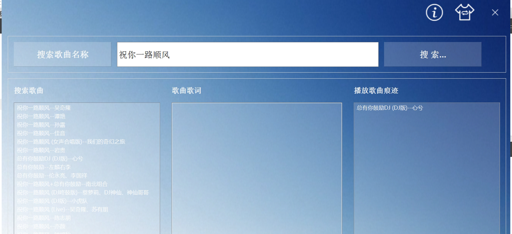
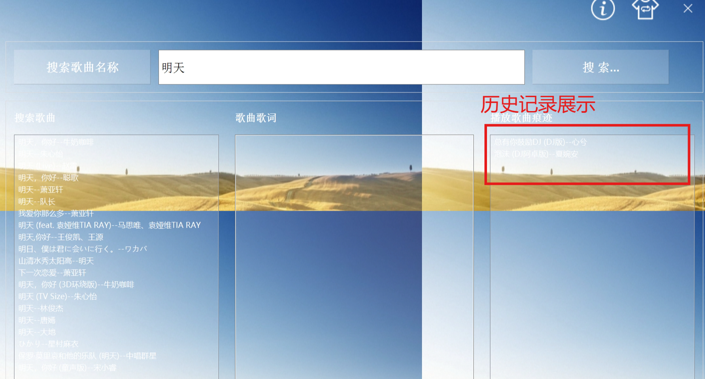

数据库表设计与实现：歌曲查询表，历史播放歌曲表

```C++
// 1:判断数据库连接是否存在，存在就得到连接，如果不存在添加得到链接
    if(QSqlDatabase::contains("sql_default_connection"))
    {
        // 根据数据库默认连接名称得到连接
        db=QSqlDatabase::database("sql_default_connection");
    }
    else
    {
        db=QSqlDatabase::addDatabase("QSQLITE"); // 添加数据库，得到该数据库的默认连接
        db.setDatabaseName("mp3listdatabase.db"); // 设置数据库文件名称
    }

    // 2:打开数据库，打开标识（QSqlQuery类
    if(!db.open())
    {
        QMessageBox::critical(0,QObject::tr("Open Data Error."),db.lastError().text());
    }
    else
    {
        // 3:定义query对象，得到打开的数据库标识
        QSqlQuery query;

        QString sql="create table if not exists searchlist(id integer,songname text,singername text,album_id text,hash text)";

        if(!query.exec(sql))
        {
            QMessageBox::critical(0,QObject::tr("create searchlist Error."),db.lastError().text());
        }      
    }
}

```

```C++
 QSqlQuery query;
 query.exec(sql)
```

•信号与槽机制：点击历史歌曲或查询到的歌曲信号发送给播放音乐的槽函数。

```C++
connect(ui->listWidget_Search, SIGNAL(doubleClicked(QModelIndex)), this, SLOT(playSearchMusic()));
    connect(ui->listWidget_History, SIGNAL(doubleClicked(QModelIndex)), this, SLOT(playHistoryMusic()));
```

•搜索网络中的音乐：使用酷狗音乐的查找URL访问HTTP网页。得到网页返回信息使用信号与槽机制，对结果进行解析

```C++
 // 根据用户输入的MP3音乐名称，发起请求操作
    QString url = kugouSearchApi + QString("format=json&keyword=%1&page=1&pagesize=20&showtype=1").arg(ui->lineEdit_Search->text());

    httpAccess(url);
```

•网络请求与读取网络数据：实例化网络请求操作事项和网络管理，通过Get方法，上传具体的请求,当网页回复消息时，触发信号与槽机制，读取数据信息

```C++
// 访问HTTP网页
void MainWidget::httpAccess(QString url) // OK
{
    // 实例化网络请求操作事项
    request = new QNetworkRequest;

    // 将url网页地址存入 request请求当中
    request->setUrl(url);

    // 实例化网络管理（访问）
    manager = new QNetworkAccessManager;

    // 通过get方法，上传具体的请求
    manager->get(*request);

    // 当网页回复消息时，触发 finished信号，我们才能够读取数据信息
    connect(manager, SIGNAL(finished(QNetworkReply*)), this, SLOT(netReply(QNetworkReply*)));
}

```




